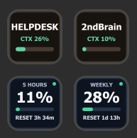
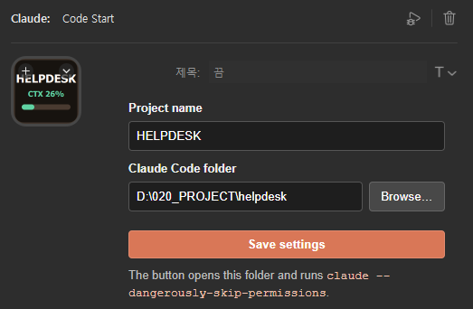

# Claude for Stream Deck

[English](#english) · [한국어](#korean) · [简体中文](#chinese) · [日本語](#japanese)

A personal Windows Stream Deck plugin for controlling Claude Code and displaying usage and session status directly on Stream Deck keys.

## Preview

| Stream Deck keys | Code Start settings |
| --- | --- |
|  |  |

---

<a id="english"></a>

## English

### Overview

Claude for Stream Deck displays Claude Code subscription limits, launches configured projects, and tracks the context usage and activity of each launched session.

> [!WARNING]
> `Code Start` intentionally launches `claude --dangerously-skip-permissions`. Use it only with folders and repositories you trust.

### Actions

- **5-Hour Usage**: Displays the used percentage and reset countdown for the five-hour window.
- **Weekly Usage**: Displays the used percentage and reset countdown for the seven-day window.
- **Code Start**: Opens Claude Deck Companion in a configured project folder, starts Claude Code inside that app, and displays that session's project name, current model, context usage bar, and activity status.

Each action has a separate UUID and can be placed on an independent key. A Code Start placement persists its session binding, so moving a running button to another key keeps the same context display.

The Code Start model text changes color according to session activity:

- Green: Claude Code is running.
- Red: Claude Code is idle.
- Blue: Claude Code is waiting for your answer.
- `Closed`: The terminal session has ended.

### Data source

Claude Code provides `rate_limits.five_hour` and `rate_limits.seven_day` through its status-line JSON. When no other status-line command is configured, the included bridge requests a one-second status-line refresh, prevents a stale session from lowering a newer value within the same reset window, stores only those fields in `%LOCALAPPDATA%\ClaudeUsageDeck\usage.json`, and forwards the original input to any pre-existing status-line command recorded from earlier installs. When another command already owns Claude Code's single status-line slot, the installer leaves that command in place and only installs the lifecycle hooks used by Code Start.

The plugin never reads `.claude/.credentials.json`.

If OMC HUD or another status-line command already owns Claude Code's single status-line slot, ClaudeUsageDeck preserves it. Code Start lifecycle hooks continue to work. Usage keys first read OMC's fresh Anthropic usage cache (when present), so the 5-hour and weekly values stay aligned without replacing OMC's command; if no fresh cache is available they show `STATUSLINE BUSY` rather than claiming stale data is live.

### Install and use

Requirements: Windows 10 or later, Stream Deck 7.1 or later, Claude Code, and Windows Terminal. The Companion installer checks for `wt.exe`; if it is missing, it runs `winget install --id Microsoft.WindowsTerminal -e --source winget --silent --accept-package-agreements --accept-source-agreements`, rechecks, and aborts with a manual Microsoft install link if Windows Terminal still cannot be confirmed.

1. Download the Windows release ZIP from the [latest GitHub release](https://github.com/hanbroz/stream-deck-claude/releases/latest), extract it, and run `Install.cmd`.
2. In Stream Deck, drag a usage action or `Code Start` onto a key.
3. For Code Start, enter a project name, select the Claude Code folder, and save the settings.
4. Press the key once. Claude Deck Companion opens for that folder, the plugin backs up `~/.claude/settings.json`, installs the bridge and lifecycle hooks, and preserves existing status-line commands and hooks.
5. Send one Claude Code message. Usage keys display current percentages and reset countdowns, while Code Start displays the launched session's current model and context usage bar.

The Companion includes an explorer for the configured project root and a terminal-open action that runs `wt.exe -d <project-folder>` without starting Claude. File operations stay inside the configured root.

The Companion renderer follows the imported Claude Design screen in [`companion/ClaudeCodeApp.dc.html`](companion/ClaudeCodeApp.dc.html): an orange-accented Visual Studio-style title bar, project explorer, session tabs, terminal split, context menu, and chat dock. The Electron renderer translates that design into regular DOM/CSS while retaining the live Claude PTY and project-file operations.

The maintained visual contract is documented in [`DESIGN.md`](DESIGN.md). The renderer keeps the reference's 40px title bar, 36px session tabs, 260px explorer, Cascadia Code console, optional embedded terminal split, bottom composer dock, and orange focus states; runtime-only controls are kept in compact explorer actions or context menus so they do not displace the reference layout. The Claude output area is selectable/read-only, while the composer accepts Korean text, clipboard images, Enter-to-send, and Shift+Enter newlines.

If Code Start still opens the previous dark console window with a native `File / Edit / View / Window` menu, the old Companion binary is still being used. For a released/installed plugin, install the matching `Claude Deck Companion Setup *.exe` once and restart Stream Deck. During local development you do not need to reinstall for every change: run `npm run companion:dir`, keep the plugin linked with `npm exec -- streamdeck link com.hanbroz.claude-usage.sdPlugin`, and Code Start resolves `dist/companion/win-unpacked/Claude Deck Companion.exe` before the per-user installed copy. `CLAUDE_DECK_COMPANION_PATH` can also point Stream Deck at a specific unpacked executable.

Usage keys check the local cache every second and skip unchanged images. These refreshes do not send Claude requests or consume usage. The value can still trail the web dashboard until Claude Code publishes a newer `rate_limits` payload; if a reset time passes first, the key displays `REFRESH` instead of a stale percentage.

### Local development

```powershell
npm install
npm test
npm run typecheck
npm run build
npm run validate
npm run verify:bridge
npm run companion:test
npm run companion:build
npm run companion:dir
npm run companion:package
npm run pack
npm run release:windows
```

For local Stream Deck development, link the plugin folder with:

```powershell
npm exec -- streamdeck link com.hanbroz.claude-usage.sdPlugin
```

`npm run preview` writes actual-account SVG previews to `dist/previews` after a successful build.

`npm run release:windows` runs the verification pipeline, builds the Companion installer, packages the Stream Deck plugin, and creates a versioned Windows recovery ZIP containing the Companion installer, `.streamDeckPlugin`, Korean installation guide, launcher, and SHA-256 checksums. The Companion NSIS installer opens the bundled Stream Deck plugin after Companion files are installed.

Building the Companion installer rebuilds `node-pty` for Electron. The build machine therefore needs a supported Visual Studio Desktop development with C++ workload and access to the Electron download cache or network; end users do not need Visual Studio.

`npm run companion:dir` is the fast local-development path and intentionally skips that native rebuild, so renderer/main changes can be picked up without reinstalling the Companion. Run `npm run companion:rebuild` once after changing Electron or `node-pty` versions (the release `companion:package` command performs it automatically).

### Privacy and local data

- The plugin does not read Claude credentials.
- Prompts and assistant responses are never persisted by the bridge.
- Usage and context caches are stored locally under `%LOCALAPPDATA%\ClaudeUsageDeck`.
- Project folders and button settings remain in the local Stream Deck profile.

[Back to language selection](#claude-for-stream-deck)

---

<a id="korean"></a>

## 한국어

### 개요

Claude for Stream Deck은 Claude Code 구독 사용량을 표시하고, 설정한 프로젝트에서 Claude Code를 실행하며, 실행한 각 세션의 컨텍스트 사용량과 활동 상태를 Stream Deck 버튼에 표시하는 Windows용 개인 플러그인입니다.

> [!WARNING]
> `Code Start`는 의도적으로 `claude --dangerously-skip-permissions`를 실행합니다. 신뢰할 수 있는 폴더와 저장소에서만 사용하십시오.

### 기능

- **5-Hour Usage**: 5시간 한도의 사용률과 초기화까지 남은 시간을 표시합니다.
- **Weekly Usage**: 7일 한도의 사용률과 초기화까지 남은 시간을 표시합니다.
- **Code Start**: 설정한 프로젝트 폴더에서 터미널과 Claude Code를 실행하고, 해당 세션의 프로젝트명·현재 모델·컨텍스트 사용량 막대·활동 상태를 표시합니다.

각 기능은 별도의 UUID를 사용하므로 서로 다른 버튼에 자유롭게 배치할 수 있습니다. Code Start는 세션 연결 정보를 유지하므로, 실행 중인 버튼을 다른 칸으로 옮겨도 동일한 컨텍스트 정보를 계속 표시합니다.

Code Start의 모델 텍스트 색상은 세션 상태에 따라 변경됩니다.

- 녹색: Claude Code 실행 중
- 빨간색: Claude Code 대기 중
- 파란색: Claude Code가 사용자 답변을 기다리는 중
- `Closed`: 버튼으로 실행한 터미널 세션이 종료됨

### 데이터 출처

Claude Code는 상태 표시줄 JSON을 통해 `rate_limits.five_hour`와 `rate_limits.seven_day`를 제공합니다. 다른 상태 표시줄 명령이 없을 때 포함된 브리지는 상태 표시줄을 1초마다 갱신하도록 요청하고, 같은 초기화 구간에서 오래된 세션의 낮은 값이 최신 높은 값을 덮어쓰지 못하게 병합합니다. 이 필드만 `%LOCALAPPDATA%\ClaudeUsageDeck\usage.json`에 저장하며, 이전 설치에서 기록한 원본 명령이 있는 경우에만 원본 입력을 그대로 전달합니다. OMC HUD처럼 다른 명령이 현재 슬롯을 사용 중이면 해당 명령을 바꾸거나 감싸지 않습니다. OMC가 제공하는 최신 Anthropic 사용량 캐시가 있으면 5시간·주간 값에 사용하고, 없거나 오래되었으면 `STATUSLINE BUSY`를 표시합니다.

플러그인은 `.claude/.credentials.json`을 읽지 않습니다.

### 설치 및 사용

요구 사항: Windows 10 이상, Stream Deck 7.1 이상

1. [최신 GitHub 릴리스](https://github.com/hanbroz/stream-deck-claude/releases/latest)에서 `com.hanbroz.claude-usage.streamDeckPlugin`을 내려받아 더블클릭하여 설치합니다.
2. Stream Deck에서 원하는 사용량 기능 또는 `Code Start`를 버튼에 배치합니다.
3. Code Start의 경우 프로젝트명을 입력하고 Claude Code를 실행할 폴더를 선택한 다음 설정을 저장합니다.
4. 버튼을 한 번 누릅니다. 플러그인은 `~/.claude/settings.json`을 백업하고 상태 표시줄 브리지와 수명 주기 훅을 설치하며, 기존 상태 표시줄 명령과 훅은 보존합니다.
5. Claude Code에서 메시지를 한 번 전송합니다. 사용량 버튼에는 현재 사용률과 초기화 시간이, Code Start에는 실행한 세션의 현재 모델·컨텍스트 사용량 막대가 표시됩니다.

Usage 버튼은 로컬 캐시를 1초마다 확인하고 값이 같으면 이미지를 다시 전송하지 않습니다. 이 갱신은 Claude 요청을 보내거나 사용량을 소비하지 않습니다. 다만 Claude Code가 새 `rate_limits` 값을 제공하기 전까지 웹 화면보다 늦을 수 있으며, 새 데이터보다 초기화 시각이 먼저 지나면 오래된 백분율 대신 `REFRESH`가 표시됩니다.

### 로컬 개발

```powershell
npm install
npm test
npm run typecheck
npm run build
npm run validate
npm run verify:bridge
npm run pack
npm run companion:dir
npm run release:windows
```

로컬 Stream Deck 개발 환경에서는 다음 명령으로 플러그인 폴더를 연결합니다.

```powershell
npm exec -- streamdeck link com.hanbroz.claude-usage.sdPlugin
```

빌드가 성공한 후 `npm run preview`를 실행하면 실제 계정 데이터를 이용한 SVG 미리보기가 `dist/previews`에 생성됩니다.

`npm run release:windows`는 전체 검증 절차를 실행하고 `.streamDeckPlugin` 설치 파일, 한국어 설치 안내서, 실행 도구, SHA-256 체크섬이 포함된 버전별 Windows 복구 ZIP을 생성합니다.

### 개인정보 및 로컬 데이터

- 플러그인은 Claude 인증 정보를 읽지 않습니다.
- 프롬프트와 Claude의 답변은 브리지에 저장되지 않습니다.
- 사용량 및 컨텍스트 캐시는 `%LOCALAPPDATA%\ClaudeUsageDeck` 아래에 로컬로 저장됩니다.
- 프로젝트 폴더와 버튼 설정은 로컬 Stream Deck 프로필에 유지됩니다.

[언어 선택으로 돌아가기](#claude-for-stream-deck)

---

<a id="chinese"></a>

## 简体中文

### 概述

Claude for Stream Deck 是一款个人使用的 Windows Stream Deck 插件，可显示 Claude Code 订阅用量、启动已配置的项目，并在 Stream Deck 按键上显示每个已启动会话的上下文用量和活动状态。

> [!WARNING]
> `Code Start` 会有意执行 `claude --dangerously-skip-permissions`。请仅在您信任的文件夹和代码仓库中使用此功能。

### 功能

- **5-Hour Usage**：显示五小时限额的已用百分比和重置倒计时。
- **Weekly Usage**：显示七天限额的已用百分比和重置倒计时。
- **Code Start**：在指定项目文件夹中打开终端并启动 Claude Code，同时显示该会话的项目名称、当前模型、上下文用量进度条以及活动状态。

每个功能使用独立的 UUID，因此可以放置在不同按键上。Code Start 会保留会话绑定，即使在运行期间将按键移动到其他位置，也能继续显示相同的上下文信息。

Code Start 的模型文字颜色会根据会话状态变化：

- 绿色：Claude Code 正在运行。
- 红色：Claude Code 处于空闲状态。
- 蓝色：Claude Code 正在等待您的回答。
- `Closed`：由按键启动的终端会话已经结束。

### 数据来源

Claude Code 通过状态栏 JSON 提供 `rate_limits.five_hour` 和 `rate_limits.seven_day`。没有其他状态栏命令时，内置桥接程序请求每秒刷新状态栏，并防止同一重置窗口中旧会话的较低值覆盖较新的较高值；它只把这些字段保存到 `%LOCALAPPDATA%\ClaudeUsageDeck\usage.json`，并仅在旧安装记录过原始命令时转发原始输入。如果 OMC HUD 等其他命令占用当前槽位，安装程序不会替换或包装该命令；存在新鲜的 OMC Anthropic 用量缓存时优先显示其数据，否则显示 `STATUSLINE BUSY`。

本插件不会读取 `.claude/.credentials.json`。

### 安装与使用

系统要求：Windows 10 或更高版本，以及 Stream Deck 7.1 或更高版本。

1. 从 [GitHub 最新版本](https://github.com/hanbroz/stream-deck-claude/releases/latest)下载 `com.hanbroz.claude-usage.streamDeckPlugin`，然后双击安装。
2. 在 Stream Deck 中，将需要的用量功能或 `Code Start` 拖放到按键上。
3. 使用 Code Start 时，输入项目名称，选择要运行 Claude Code 的文件夹，然后保存设置。
4. 按一次按键。插件会备份 `~/.claude/settings.json`，安装状态栏桥接程序和生命周期钩子，并保留已有的状态栏命令和钩子。
5. 在 Claude Code 中发送一条消息。用量按键会显示当前百分比和重置倒计时，Code Start 则会显示已启动会话的当前模型和上下文用量进度条。

用量按键每秒检查一次本地缓存，并跳过未变化的图像。这不会发送 Claude 请求，也不会消耗用量。在 Claude Code 发布新的 `rate_limits` 数据前，该值仍可能落后于网页；如果重置时间先到，按键会显示 `REFRESH`，而不是过期的百分比。

### 本地开发

```powershell
npm install
npm test
npm run typecheck
npm run build
npm run validate
npm run verify:bridge
npm run pack
npm run companion:dir
npm run release:windows
```

进行本地 Stream Deck 开发时，使用以下命令链接插件文件夹：

```powershell
npm exec -- streamdeck link com.hanbroz.claude-usage.sdPlugin
```

构建成功后，`npm run preview` 会将基于实际账户数据的 SVG 预览写入 `dist/previews`。

`npm run release:windows` 会执行完整验证流程，并生成带版本号的 Windows 恢复 ZIP，其中包含 `.streamDeckPlugin` 安装包、韩文安装指南、启动工具和 SHA-256 校验值。

### 隐私与本地数据

- 插件不会读取 Claude 凭据。
- 桥接程序不会保存提示词或 Claude 的回答。
- 用量和上下文缓存仅存储在本机的 `%LOCALAPPDATA%\ClaudeUsageDeck` 目录下。
- 项目文件夹和按键设置保留在本地 Stream Deck 配置文件中。

[返回语言选择](#claude-for-stream-deck)

---

<a id="japanese"></a>

## 日本語

### 概要

Claude for Stream Deckは、Claude Codeのサブスクリプション使用量を表示し、設定したプロジェクトでClaude Codeを起動して、各セッションのコンテキスト使用量と稼働状態をStream Deckのキーに表示する個人向けWindowsプラグインです。

> [!WARNING]
> `Code Start`は意図的に`claude --dangerously-skip-permissions`を実行します。信頼できるフォルダーとリポジトリでのみ使用してください。

### 機能

- **5-Hour Usage**：5時間枠の使用率とリセットまでの残り時間を表示します。
- **Weekly Usage**：7日間枠の使用率とリセットまでの残り時間を表示します。
- **Code Start**：指定したプロジェクトフォルダーでターミナルとClaude Codeを起動し、そのセッションのプロジェクト名、現在のモデル、コンテキスト使用量バー、稼働状態を表示します。

各機能は個別のUUIDを使用するため、それぞれ別のキーに配置できます。Code Startはセッションとの紐付けを保持するため、実行中のキーを別の位置へ移動しても同じコンテキスト情報を表示し続けます。

Code Startのモデルテキストは、セッションの状態に応じて色が変わります。

- 緑：Claude Codeが実行中です。
- 赤：Claude Codeが待機中です。
- 青：Claude Codeがユーザーの回答を待っています。
- `Closed`：キーから起動したターミナルセッションが終了しました。

### データソース

Claude CodeはステータスラインJSONを通じて`rate_limits.five_hour`と`rate_limits.seven_day`を提供します。他のステータスラインコマンドがない場合、同梱のブリッジはステータスラインを1秒ごとに更新するよう要求し、同じリセット期間で古いセッションの低い値が新しい高い値を上書きしないようにします。これらのフィールドだけを`%LOCALAPPDATA%\ClaudeUsageDeck\usage.json`に保存し、以前のインストールで記録した元のコマンドがある場合だけ入力を転送します。OMC HUDなど別のコマンドがスロットを使用中の場合は置き換えません。新鮮なOMC Anthropic用量キャッシュがあればその値を優先し、なければ`STATUSLINE BUSY`を表示します。

このプラグインは`.claude/.credentials.json`を読み取りません。

### インストールと使用方法

必要環境：Windows 10以降、Stream Deck 7.1以降

1. [最新のGitHubリリース](https://github.com/hanbroz/stream-deck-claude/releases/latest)から`com.hanbroz.claude-usage.streamDeckPlugin`をダウンロードし、ダブルクリックしてインストールします。
2. Stream Deckで、使用量機能または`Code Start`をキーに配置します。
3. Code Startでは、プロジェクト名を入力し、Claude Codeを実行するフォルダーを選択して設定を保存します。
4. キーを一度押します。プラグインは`~/.claude/settings.json`をバックアップし、ステータスラインブリッジとライフサイクルフックをインストールします。既存のステータスラインコマンドとフックは保持されます。
5. Claude Codeでメッセージを1件送信します。使用量キーには現在の割合とリセットまでの残り時間が、Code Startには起動したセッションの現在のモデルとコンテキスト使用量バーが表示されます。

使用量キーはローカルキャッシュを1秒ごとに確認し、画像が変わらない場合は再送しません。この更新はClaudeへのリクエストを送信せず、使用量も消費しません。Claude Codeが新しい`rate_limits`データを公開するまではWeb画面より遅れる場合があり、先にリセット時刻を過ぎた場合は古い割合の代わりに`REFRESH`が表示されます。

### ローカル開発

```powershell
npm install
npm test
npm run typecheck
npm run build
npm run validate
npm run verify:bridge
npm run pack
npm run companion:dir
npm run release:windows
```

ローカルのStream Deck開発環境では、次のコマンドでプラグインフォルダーをリンクします。

```powershell
npm exec -- streamdeck link com.hanbroz.claude-usage.sdPlugin
```

ビルド成功後に`npm run preview`を実行すると、実際のアカウントデータを使用したSVGプレビューが`dist/previews`に出力されます。

`npm run release:windows`は完全な検証パイプラインを実行し、`.streamDeckPlugin`インストーラー、韓国語のインストールガイド、ランチャー、SHA-256チェックサムを含むバージョン付きWindowsリカバリーZIPを作成します。

### プライバシーとローカルデータ

- プラグインはClaudeの認証情報を読み取りません。
- プロンプトとClaudeの応答はブリッジに保存されません。
- 使用量とコンテキストのキャッシュは`%LOCALAPPDATA%\ClaudeUsageDeck`配下にローカル保存されます。
- プロジェクトフォルダーとキーの設定は、ローカルのStream Deckプロファイル内に保持されます。

[言語選択に戻る](#claude-for-stream-deck)
